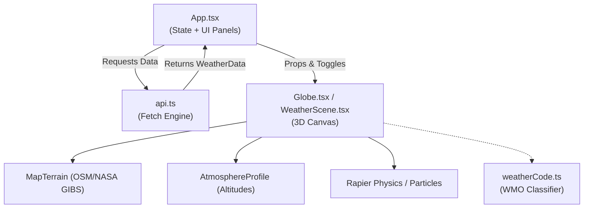

<div align="center">
  
  <h1>Aethra</h1>
  <p><strong>Live Weather & Atmospheric Data Visualization in Stunning 3D</strong></p>
  
  <p>
    <a href="https://reactjs.org/"></a>
    <a href="https://threejs.org/"></a>
    <a href="https://docs.pmnd.rs/react-three-fiber"></a>
    <a href="https://vitejs.dev/"></a>
    <a href="https://www.typescriptlang.org/"></a>
  </p>
</div>

<br />

**Aethra** is an interactive, real-time 3D weather visualization dashboard. Unlike standard 2D weather apps, Aethra leverages modern web graphics and live scientific data to render accurate, physically-simulated atmospheric phenomena right in your browser. 

Search any city globally to experience an immersive vertical atmosphere "sounding," localized real-time precipitation particles, and a comprehensive data dashboard backed by top-tier meteorological sources.

---

## ✨ Key Features

- **🌍 3D Interactive Globe:** A seamless `Three.js` globe featuring a static Level of Detail (LoD) view that dynamically transitions into localized weather effects based on your search.
- **⛈️ Authentic Weather Phenomena:** Real-time rendering of rain, snow, fog, storms, and cloud coverage directly driven by the official WMO weather codes. No heuristics—just data.
- **🛰️ NASA Satellite Integration:** Cross-check live conditions with the latest NASA POWER meteorological data and NASA GIBS satellite imagery.
- **📊 Vertical Atmospheric Profiling:** Live readings of temperature, wind, and humidity plotted across 5 distinct pressure altitudes (1000 to 300 hPa).
- **⚡ High-Performance Physics:** Powered by WebAssembly (`@react-three/rapier`) to calculate rigid-body physics like wind-shear forces and bouncing hail.

## 🛠️ Technology Stack

| Layer | Technology |
|---|---|
| **Build Tool** | Vite 8 |
| **Language** | TypeScript 5.7 (strict) |
| **UI Framework** | React 19 |
| **3D Rendering** | Three.js + `@react-three/fiber` |
| **3D Helpers** | `@react-three/drei` (OrbitControls, Text, Line, Stars) |
| **Physics** | `@react-three/rapier` (WebAssembly physics engine) |
| **Post-Processing** | `@react-three/postprocessing` (Bloom) |
| **Icons** | `lucide-react` |

Aethra is a purely client-side static Single Page Application (SPA). It requires zero backend infrastructure, seamlessly fetching from three distinct external public APIs.

---

## 🏗️ Architecture & Data Flow

`src/api.ts` acts as the single source of truth for all external data. Calls are made in parallel via `Promise.allSettled` to:
1. **Open-Meteo Current & Daily Forecast** (Weather codes, temps, humidity).
2. **Open-Meteo Pressure Levels** (NWP model data).
3. **NASA POWER** (Cross-checking validation).
4. **Open-Meteo Geocoding** (City names to coordinates).

### Core Interaction Diagram



> **Design Pattern Note:** 
> Components in Aethra are **self-gating**. Instead of massive conditional trees, the scene mounts every phenomenon layer. Each layer internally evaluates the `classifyWeatherCode()` result and returns `null` if its condition isn't met (e.g., `SnowLayer` only renders for snow codes).

---

## 📂 Repository Structure

| File | Role |
|---|---|
| `main.tsx` | React initialization and StrictMode wrapper. |
| `App.tsx` | Global state, API orchestration, and dashboard UI layout. |
| `Globe.tsx` | The central 3D globe, containing localized dynamic weather effects and texture loaders. |
| `api.ts` | External API handlers and strict TypeScript interfaces (`WeatherData`, `AtmosphericLevel`). |
| `weatherCode.ts` | WMO numerical code to `PhenomenonCategory` mapper. |
| `MapTerrain.tsx` | Handles basemap texturing (OpenStreetMap or NASA GIBS) with date-fallback logic. |
| `AtmosphereProfile.tsx` | Renders the 5 real pressure-level planes, complete with wind arrows and readouts. |
| `Physics & Layers` | Files like `RainLayer.tsx`, `SnowLayer.tsx`, and `HailLayer.tsx` that drive the visual phenomena. |
| `index.css` | The complete design system for panels, the toolbar, and the dynamic drawer. |

---

## 🚀 Getting Started

### Prerequisites
- Node.js (v18.18.0 or higher)
- npm or yarn

### Installation
```bash
# Clone the repository
git clone https://github.com/yourusername/aethra.git

# Navigate into the project
cd aethra

# Install dependencies
npm install

# Start the development server
npm run dev
```

### Building for Production
```bash
# Build the optimized static bundle
npm run build

# Preview the production build locally
npm run preview
```

---

## ⚖️ Scientific Constraints & Transparency

Aethra is designed to be highly accurate, but it operates within browser limitations:
- **Simplified Simulation**: It utilizes 5 standard pressure levels instead of a full continuous reanalysis grid, applying rigid-body physics in place of full computational fluid dynamics (CFD).
- **Satellite Data**: NASA GIBS satellite imagery uses a daily composite, with intelligent fallback logic to the most recent viable date.
- **Data Segregation**: NASA POWER data is strictly presented in its own cross-check panel, separate from the primary Open-Meteo pipeline.

<br/>

<div align="center">
  <sub>Built with ❤️ using React and Three.js. Data provided by <a href="https://open-meteo.com/">Open-Meteo</a> and <a href="https://power.larc.nasa.gov/">NASA POWER</a>.</sub>
</div>
