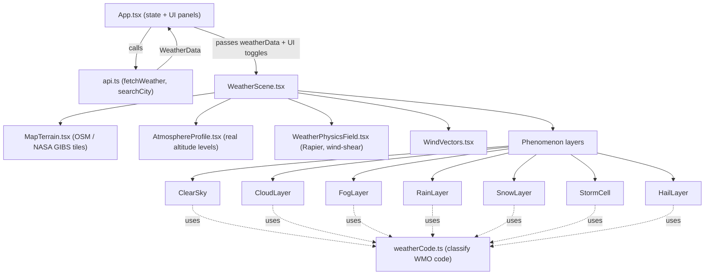

# Aethra — Project Overview

## What this project does

**Aethra** is a real-time 3D weather visualization dashboard. You search a city and it renders:

- A real satellite/street map centered on that location
- A live vertical atmosphere "sounding" (temperature/wind/humidity at 5 real altitude levels)
- Physically-simulated weather phenomena (rain, snow, fog, storms, hail, clouds) that only appear when actually happening, based on real classification codes
- A data dashboard (current conditions, 7-day forecast, cross-referenced sources)

It's not a toy — every visual element is driven by live API data rather than decoration, and phenomena are gated by the official WMO weather code rather than heuristics.

## Tech stack

| Layer | Technology |
|---|---|
| Build tool | Vite 8 |
| Language | TypeScript 5.7 (strict) |
| UI framework | React 19 |
| 3D rendering | Three.js + `@react-three/fiber` |
| 3D helpers | `@react-three/drei` (OrbitControls, Text, Line, Stars) |
| Physics | `@react-three/rapier` (WebAssembly physics engine) |
| Post-processing | `@react-three/postprocessing` (Bloom) |
| Icons | `lucide-react` |
| Linting | ESLint 9 + typescript-eslint (flat config) |
| Static preview | `serve.py` — a small Python HTTP server for previewing `dist/` after build (dev convenience, unrelated to the app's core stack) |

No backend — it's a static SPA that calls three external public APIs directly from the browser.

## Entry points

```
index.html → src/main.tsx → src/App.tsx
```

- `index.html` — Vite's HTML shell, mounts `#root`
- `src/main.tsx` — React root, wraps `<App />` in `StrictMode`
- `src/App.tsx` — top-level component: owns all UI state (search, realtime polling, basemap mode, atmosphere variable, zoom), fetches weather data, and lays out the dashboard + `<Canvas>`

## Data layer

`src/api.ts` is the single source of truth for external data, fetched in parallel via `Promise.allSettled`:

1. **Open‑Meteo current/daily forecast** — temperature, wind, humidity, pressure, cloud cover, `weather_code` (WMO code), `is_day`
2. **Open‑Meteo pressure-level API** — real NWP model levels (1000/850/700/500/300 hPa) → `AtmosphericLevel[]`
3. **NASA POWER** — independent cross-check (temperature/wind/humidity), with sentinel `-999` values filtered out
4. **Open‑Meteo geocoding** — city name → lat/lon

`src/weatherCode.ts` classifies the raw WMO code into a `PhenomenonCategory` (clear/cloudy/fog/drizzle/rain/freezing-rain/snow/rain-showers/snow-showers/thunderstorm/thunderstorm-hail) — this is the backbone that drives which 3D components render.

## Core module interaction



Key design pattern: **self-gating components**. `WeatherScene.tsx` unconditionally mounts every phenomenon component; each one internally calls `classifyWeatherCode()` and returns `null` if its condition isn't met (e.g., `SnowLayer` only renders for snow codes, `HailLayer` only for codes 96/99). This keeps the scene wiring simple and guarantees mutually-consistent, non-overlapping effects.

## File-by-file map (`src/`)

| File | Role |
|---|---|
| `main.tsx` | React root |
| `App.tsx` | State, data fetching orchestration, dashboard UI |
| `api.ts` | All external API calls + `WeatherData`/`AtmosphericLevel` types |
| `weatherCode.ts` | WMO code → phenomenon category classifier |
| `tileMath.ts` | Shared lon/lat → slippy-map tile math (OSM + NASA GIBS both use it) |
| `WeatherScene.tsx` | R3F scene composition — lights, camera controls, mounts all sub-components |
| `MapTerrain.tsx` | Fetches/builds the basemap texture (OpenStreetMap or NASA GIBS satellite), with date-fallback logic for satellite imagery |
| `AtmosphereProfile.tsx` | Renders the 5 real pressure-level planes + wind arrows + text readouts |
| `WeatherPhysicsField.tsx` | Rapier air-parcel physics driven by real per-altitude wind (wind shear) |
| `ClearSky.tsx` | Sun/moon + stars (real `is_day`, clear-sky codes) |
| `CloudLayer.tsx` | Drifting cloud puffs (real `cloud_cover`) |
| `FogLayer.tsx` | Real THREE.js scene fog (`fogExp2`), fog codes only |
| `RainLayer.tsx` | Shader-based falling rain, rain/drizzle/freezing-rain codes |
| `SnowLayer.tsx` | Shader-based falling snow, snow codes only |
| `StormCell.tsx` | Anvil-cloud storm shape, thunderstorm codes only |
| `HailLayer.tsx` | Rapier-physics bouncing hail pellets, hail codes only |
| `WindVectors.tsx` | Instanced wind-direction arrow field |
| `ScientificBoundingBox.tsx` | Scene boundary frame/axis labels |
| `Legend.tsx` | Color-scale legend for the selected atmosphere variable |
| `index.css` | Design system (panels, toolbar, dashboard grid) |

## Config/build files

- `vite.config.ts` — Vite + `@vitejs/plugin-react`
- `tsconfig.json` / `tsconfig.app.json` / `tsconfig.node.json` — TS project references (app code vs. Vite config)
- `eslint.config.js` — flat ESLint config (typescript-eslint + react-hooks + react-refresh)
- `serve.py` — optional static server for the production `dist/` build (LAN-accessible)

## Notable honesty/limits baked into the code

- Real data throughout, but explicitly **not** a full NWP/CFD simulation — it uses 5 standard pressure levels (not a full reanalysis grid) and simplified rigid-body physics (not fluid dynamics).
- NASA GIBS satellite imagery is a daily composite (not live), with automatic multi-day fallback and an on-screen date label.
- NASA POWER is shown purely as a cross-check panel, separate from the primary Open‑Meteo data.
